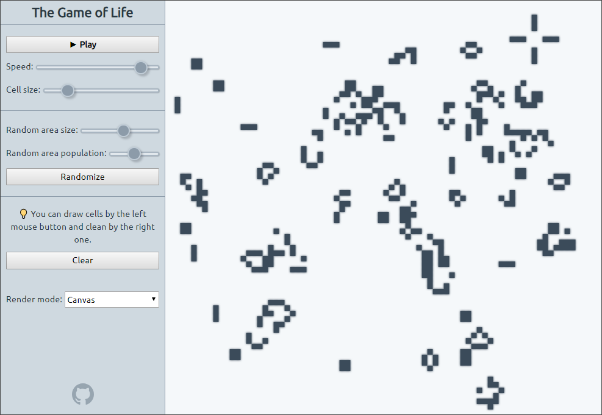

# React-game-life 

> The Game of Life in React+Redux

## Features

* :art: Free draw own cells by mouse.
* :zap:️ 2 render modes - pure React and classic canvas.
* :wrench: Control speed, cell size and randomization params.

## Play

[ [>> **Play online** <<](https://avin.github.io/react-game-life) ]

## Another games

Check my another React+Redux games:

* [Tetris](https://github.com/avin/react-game-tetris)
* [Snake](https://github.com/avin/react-game-snake)
* [15 puzzle](https://github.com/avin/react-game15)

## License

MIT © [avin](https://github.com/avin)
